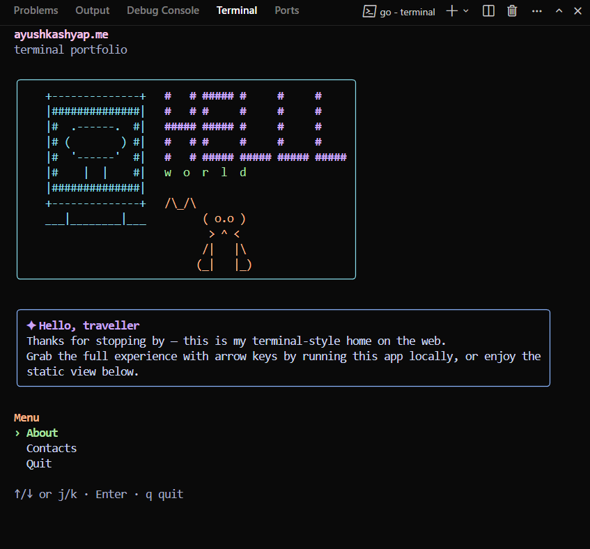

# ayushkashyap.me — terminal portfolio

A small **Go** project: an interactive **terminal UI** (Bubble Tea) for local use, plus an **HTTP** mode so people can **`curl`** a styled ANSI snapshot of the same content.



## What it does

- **Local:** run the app without flags to get the full-screen menu (arrow keys, sections for About and Contacts, opens links in the browser).
- **Server:** run with `-serve` to expose `GET /terminal` (plain text + ANSI colors) for sharing or hosting (e.g. Fly.io + Docker).

## Requirements

- [Go](https://go.dev/dl/) 1.25+ (see `go.mod`)

## Run locally

```bash
go run .
```

Interactive TUI — navigate with **↑ / ↓** or **j / k**, **Enter** to select, **q** to quit.

## HTTP mode (curl)

```bash
go run . -serve
```

Then (Windows PowerShell — use `curl.exe`, not `curl`):

```powershell
curl.exe -sS http://127.0.0.1:8080/terminal
```

## Deploy

The repo includes a **`Dockerfile`** and **`fly.toml`** for [Fly.io](https://fly.io/). Build and run the container with `ENTRYPOINT ["/terminal", "-serve"]`; the app listens on **`PORT`** when `-addr` is omitted.

## Roadmap / ideas

Things I want to add over time:

- **Games** in the terminal (e.g. snake, trivia, or small interactive mini-games in the TUI).
- **More sections** beyond About / Contacts (projects, blog links, résumé shortcuts).
- **Richer curl output** (optional themes, `?plain=1` for no ANSI, etc.).
- **Polish:** sound-off animations, better small terminals, and maybe SSH or other ways to expose the interactive UI remotely.

Pull requests and ideas are welcome once this repo is public.

